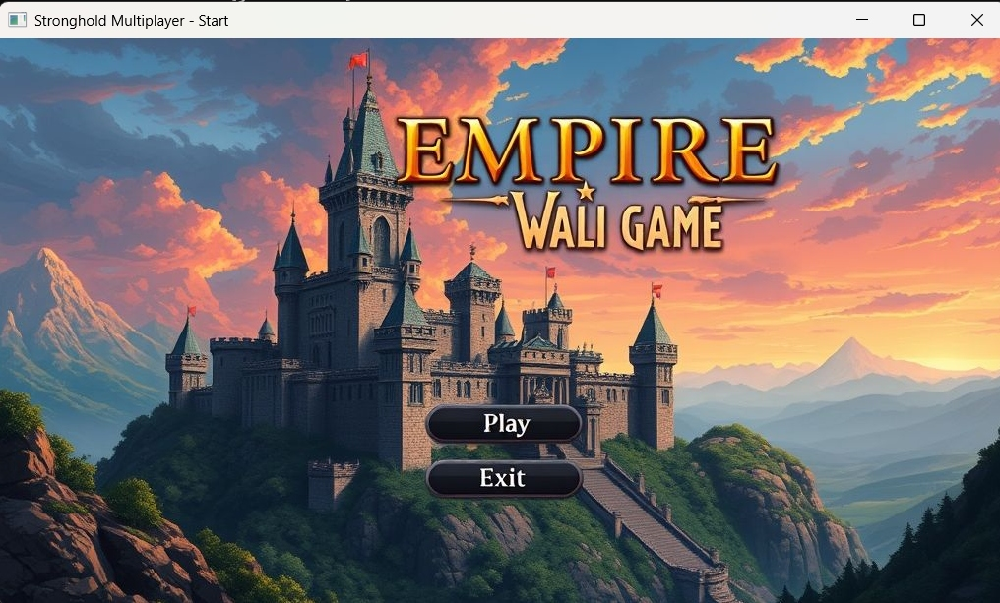
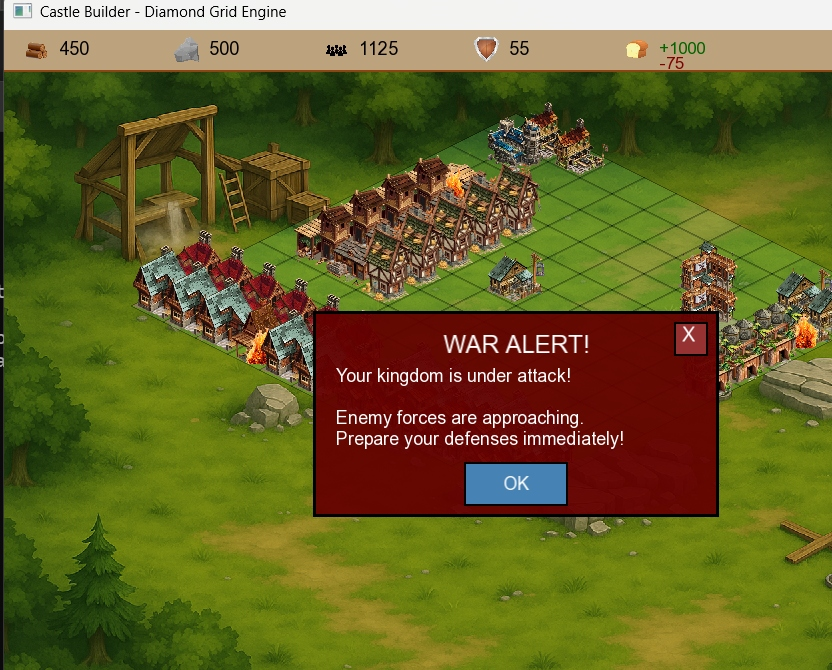
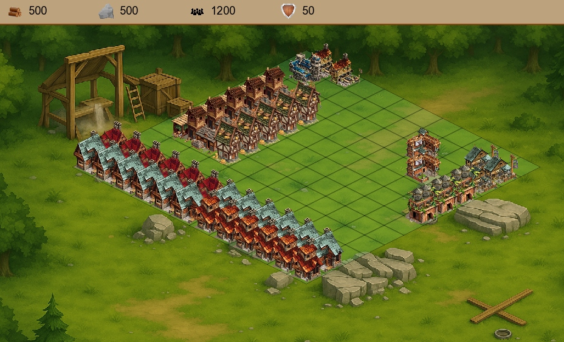

# 🏰 Empire Wali Game — Stronghold

> A medieval castle-building strategy game written in **C++ with SFML**

## 📖 Overview

Stronghold is a graphical, medieval castle-building strategy game. Players manage internal kingdom systems — economy, population, military, and disasters — to build a thriving stronghold. Phase 2 extends the game with war simulation, diplomacy, multiplayer, and an AI engine.

---

## 📸 Gameplay Screenshots






---


## 🗂️ Project Structure

```
empire-wali-game/
├── src/                    ← All C++ source & header files
│   ├── main.cpp
│   ├── Kingdom.cpp / Kingdom.h
│   ├── Building.h / BuildingManager.h
│   ├── WarSystem.h / Diplomacy.h
│   ├── TradingSystem.h / TradeManager.h
│   └── ...
├── assets/
│   ├── images/             ← Game sprites and textures
│   └── fonts/              ← Font files (ARIAL.TTF)
├── include/
│   └── SFML/               ← SFML library headers
├── lib/                    ← SFML static/dynamic link libraries
├── project/                ← Visual Studio solution & project files
│   ├── test2.sln
│   ├── test2.vcxproj
│   └── test2.vcxproj.filters
├── docs/                   ← Design documents and overviews
├── archive/                ← Old drafts and scratch files
└── README.md
```

---

## 🎮 Gameplay Features

| Feature | Description |
|---|---|
| 🏗️ Dynamic Castle Building | Construct 10+ unique buildings on a diamond-grid layout, each with upgrade paths |
| ⚔️ Military Management | Train guards, recruit spies, maintain morale and readiness |
| 💰 Resource System | Harvest wood and stone, distribute among peasants, merchants, and nobles |
| 🔥 Disaster Events | Random fires break out; use emergency system to extinguish them |
| 🌍 Diplomacy & War | Declare war, form alliances, and negotiate peace (Phase 2) |
| 🤝 Multiplayer | LAN-based kingdom-to-kingdom multiplayer (Phase 2) |

---

## 🏛️ Building Types

| Building | Size | Function |
|---|---|---|
| Peasant Hut | 1×1 | Lower-class dwellings |
| Merchant House | 1×1 | Middle-class dwellings |
| Noble Manor | 1×1 | Upper-class dwellings |
| Woodcutter | 1×1 | Produces wood |
| Stone Quarry | 1×1 | Produces stone |
| Guardhouse | 2×2 | Trains guards |
| Tavern | 2×2 | Recruits spies |
| Barracks | 2×2 | Military training |
| Storehouse | 1×2 | Resource storage |
| Keep | 3×3 | Castle centerpiece |

---

## ⌨️ Controls

**Construction Mode**
- `1–9` — Select building type
- `0` — Cancel selection
- `Left Click` — Place building
- `Right Click` — Remove building

**Information Panels**
- `R` — Resource production rates
- `P` — Population statistics
- `M` — Military forces report
- `C` — Class status overview

**Disaster Management**
- `J / K / L` — Trigger fires (all / dwellings / non-dwellings)
- `E` — Extinguish all fires

---

## 🛠️ Installation & Build

### Prerequisites
- Windows 10/11
- Visual Studio 2022 (v143 toolset)
- SFML 2.6.1 (included in `include/` and `lib/`)

### Steps

1. Clone the repository
   ```bash
   git clone https://github.com/unk1ndled11/empire-wali-game.git
   cd empire-wali-game
   ```

2. Open `project/test2.sln` in Visual Studio 2022

3. Set configuration to **Debug|x64** or **Release|x64**

4. Build and run (`F5`)

> **Note:** The working directory must be the repo root so that `assets/` paths resolve correctly at runtime.

---

## 💻 System Requirements

| | Minimum | Recommended |
|---|---|---|
| OS | Windows 10 | Windows 11 |
| CPU | Dual-core 2.0 GHz | Quad-core 3.0 GHz+ |
| RAM | 2 GB | 4 GB+ |
| GPU | OpenGL 3.0+ | OpenGL 4.0+ |
| Storage | 200 MB | 500 MB |

---

## 🧩 OOP Concepts Used

- Classes & Objects
- Inheritance & Polymorphism
- Encapsulation & Abstraction
- Composition & Aggregation
- Dynamic Memory Allocation & Smart Pointers
- Exception & File Handling

---

## 👥 Contributors

**Ali Ibrahim** · **Azka Faisal**

---

## 📋 Project Status

- ✅ **Phase 1 Complete** — Core Kingdom Mechanics (Building, Resources, Population, Military, Disasters)
- 🔄 **Phase 2 In Progress** — War Simulation, AI & Diplomacy Engine, Multiplayer